## day 2
### express 를 이용하여 기본적인 CRUD 를 해보자!

#### 1. 이어서 하기

- day 1 정보를 재사용하거나 day 2 의 리소스를 받아 `npm install` 명령을 수행한다.

#### 2. GET 조회를 구현해보자 (목록 / 단건)

- `index.js` 에 다음과 같은 코드를 추가하자

```
// mock data : users
const mockUsersDocument = [
    { no:1, id:'admin', name:'최고 관리자' },
    { no:2, id:'hyop0902', name:'테스터1' },
    { no:3, id:'bob9201', name:'운영자1' },
];
// generate mock user
for(let idx = 0; idx < 50; idx++){
    mockUsersDocument.push(
        { no:(idx+1), id:'test_user' + (idx+1), name:'테스트 사용자' + (idx+1) }
    );
}
```

- mock 객체는 모의 객체이다.
- 쉽게 말하면 프로그래밍상 발생하는 모듈의 결과나 요청의 객체를 실제가 아니라 모의로 생성해서 넣어보는 것이다.
- 현재는 실 DB 테스트를 하지 않을 것이니 `mockUsersDocument`를 통해 mock 객체를 만들고 데이터를 넣어 연습해보자.

- 이제 가상의 모의 디비 데이터가 준비되었으니 데이터를 조회하는 로직을 구현해보자

```
// mock query 
const findById = (userId) => {
    return mockUsersDocument.filter(data => data.id == userId);
}
const findAllByNameContains = (name = '', pageNo = 1, pageSize = 10) => {
    const startNo = (pageNo - 1) * pageSize;
    const endNo = pageNo * pageSize;
    let users = mockUsersDocument;
    if(name != '') {
        users = users.filter(data => data.name.indexOf(name) > -1);
    }
    return users.slice(startNo, endNo);
}
```

- `findById`는 키를 베이스로 조회하는 쿼리로 단건만 가져온다는 가정이다.
- `findAllByNameContains`는 이름이 포함된(실제 쿼리에서는 `like 절`) 모든 사용자를 조회한다. 페이징 처리가 포함되었다.
- 해당 함수는 나중에 내용만 실제 DB 에서 가져오는 로직으로 변경하면 된다. 이 함수를 사용 하는 함수들은 이 함수의 원형이 변하지 않으므로 추후 실 DB를 붙이더라도 수정할 필요성이 없다. 이러한 모듈 개발을 `결합도`가 낮다고 한다.


```
// users 모든 데이터 목록을 조회합니다.
app.get("/users-all", (req, res) => {
    res.json({ok: true, users: mockUsersDocument});
});

// users 목록을 조회합니다.
app.get("/users", (req, res) => {
    const { pageNo, pageSize, name } = req.query;
    const users = findAllByNameContains(name, pageNo, pageSize);
    res.json({ok: true, users: users});
});

// users 단건을 조회합니다.
app.get("/users/:id", (req, res) => {
    const userId = req.params.id;
    const user = findById(userId);
    res.json({ok: true, user: user});
});
```

- `get` 은 HTTP method 로 조회를 나타낸다.
- `get` 는 body로 쏘는 것이 가능은 하나 권장되지 않는다.
- `users-all` 같은 일괄 조회는 사실상 디비가 커질수록 온라인에서는 권장하지 않는 형태이다. `users` 같이 페이징을 권장한다.

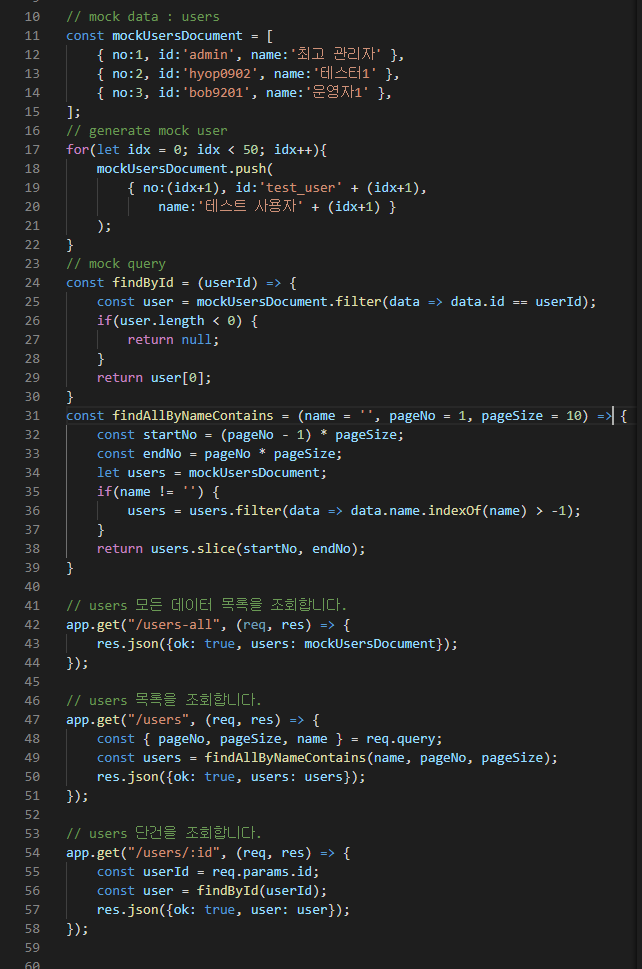</img>
- 조회 전체 코드

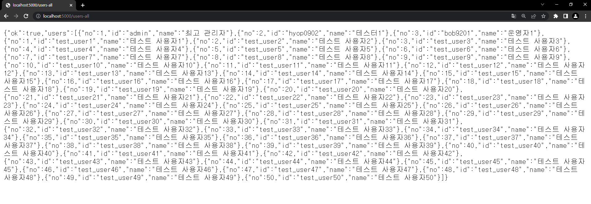</img>
- `users-all` 전체조회
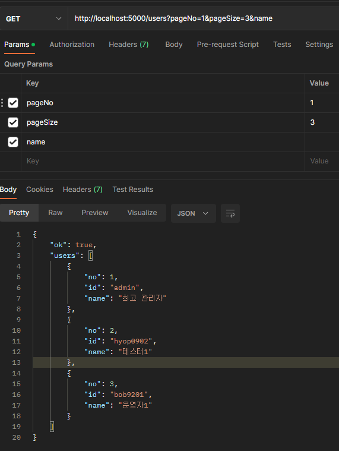</img>
- `users` 목록 조회 페이징
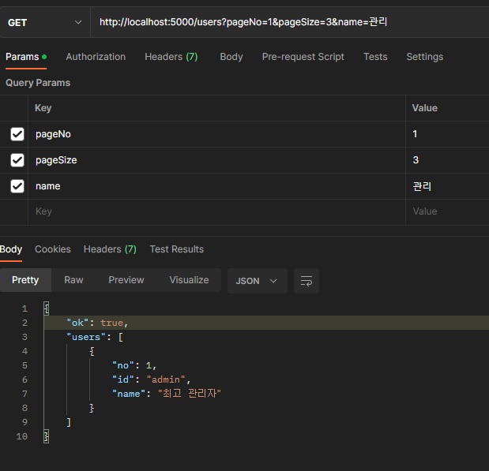</img>
- `users` 목록 조회 이름 filter 
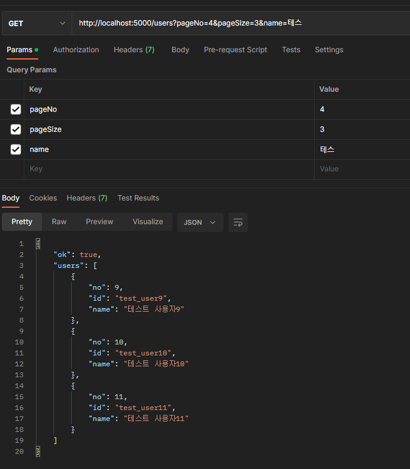</img>
- `users` 목록 조회 페이징 + 이름 filter
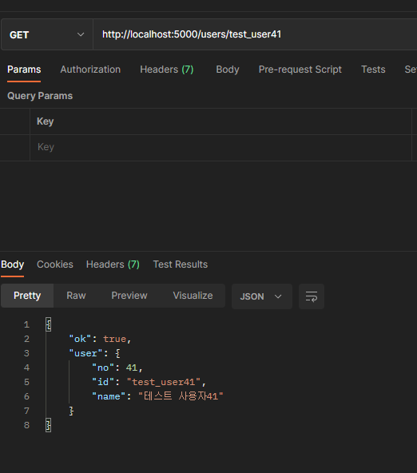</img>
- `users/:id` 단건 조회


#### 2. POST 등록을 구현해보자

- `index.js` 에 다음과 같은 코드를 추가하자

```
app.use(express.json());
app.use(express.urlencoded({ extended: true}));

// mock query 
const addUser = (id, name) => {
    let maxNo = mockUsersDocument[mockUsersDocument.length - 1]?.no;
    if(!maxNo) {
        maxNo = 0;
    }
    mockUsersDocument[mockUsersDocument.length] = 
        { no:(maxNo+1), id:id, name:name };
};
```

- `body` json 을 사용하기 위해 `json` 을 `use` 로 두었다.
- `urlencoded` 사용을 위해 코드가 추가되었다.
- `addUser`의 배열 추가 로직은 `array.push` 로 작성되어도 동일하다.

```
// users 단건을 등록합니다.
app.post("/users", (req, res) => {
    const { id, name } = req.body;
    addUser(id, name);

    const user = findById(id);
    res.json({ok: true, user: user});
});
```

- `post` 는 HTTP method 로 등록을 나타낸다.

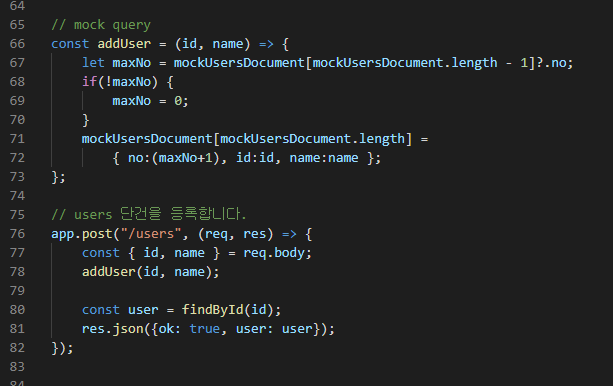</img>
- 등록 전체 코드
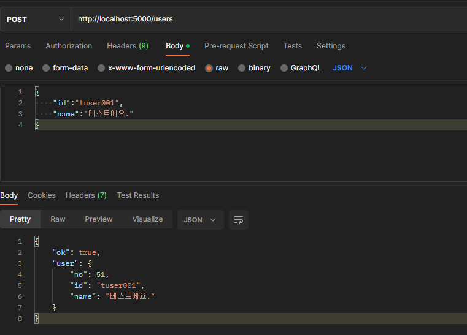</img>
- `users` 단건 등록


#### 3. PUT 수정을 구현해보자

- `index.js` 에 다음과 같은 코드를 추가하자

```
// mock query 
const findByUserKey = (no) => (
    mockUsersDocument
        .findIndex((el, idx, array) => (el.no == no))
);
const updateUser = (id, name) => {
    const user = findById(id);
    user.id = id;
    user.name = name;

    const targetIdx = findByUserKey(user.no);
    mockUsersDocument[targetIdx] = user;
};
```

- `findByUserKey` 는 배열의 인덱스 값을 구하는 로직으로 실 디비 연동시 필요가 없어 삭제해도 무방하다.
- `updateUser` 에서 회원의 아이디와 이름을 모두 교체한다.

```
// users 단건을 수정합니다.
app.put("/users/:id", (req, res) => {
    const userId = req.params.id;
    const { name } = req.body;
    updateUser(userId, name);
    
    const user = findById(userId);
    res.json({ok: true, user: user});
});
```

- `put` 은 HTTP method 로 수정을 나타낸다.
- `put` 은 `대체, 교체`의 의미를 갖는 수정이고 `patch` 는 대체는 아니고 `일부 속성만 변경`되는 것을 의미한다.
- `id` 는 사용자를 식별하는 키로써 `path-variable` 경로상 변수로 둘 수도 있다. 주로 REST 에서 권장하는 방식이다.
- `name` 은 `body` 에서 받고 있다. 이런식으로 파라미터 받는 방식을 다양하게 둘 수 있다.

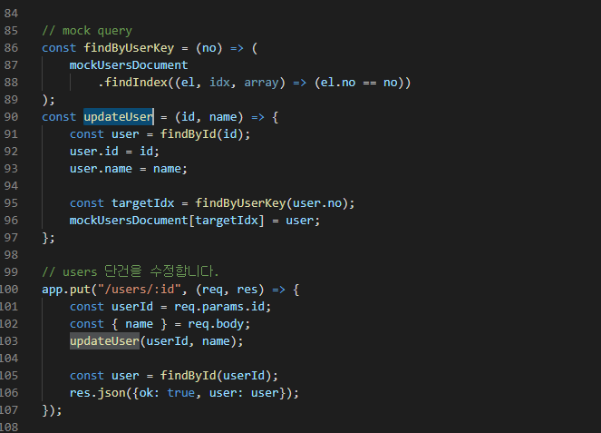</img>
- 수정 전체 코드
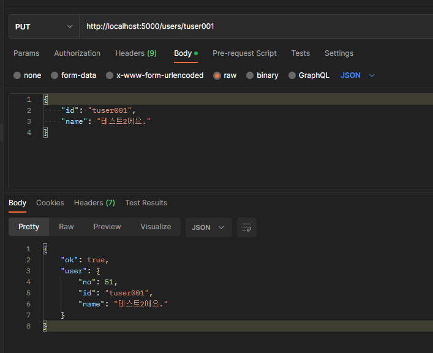</img>
- `users/:id` 수정


#### 4. DELETE 삭제를 구현해보자

- `index.js` 에 다음과 같은 코드를 추가하자

```
// mock query 
const removeUserById = (id) => {
    const user = findById(id);
    const targetIdx = findByUserKey(user.no);
    mockUsersDocument.splice(targetIdx, 1);
};

// users 단건을 삭제합니다.
app.delete("/users/:id", (req, res) => {
    const userId = req.params.id;
    removeUserById(userId);
    res.json({ok: true});
});
```

- `delete` 는 HTTP method 로 삭제를 나타낸다.
- `delete` 는 body를 사용하지 않는다.

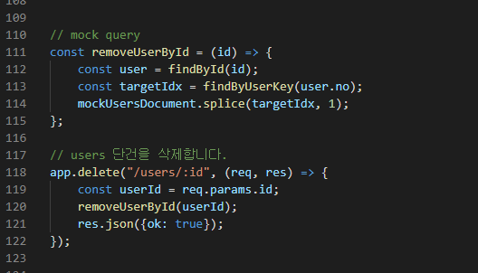</img>
- 삭제 전체 코드
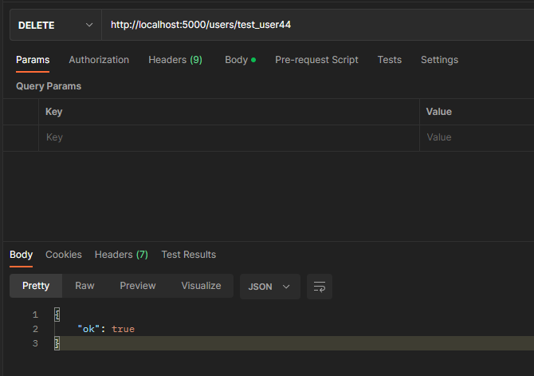</img>
- `users/:id` 삭제


- express 를 이용하여 HTTP 요청에 대해 다양한 응답을 처리할 수 있다. 

- 끝!
